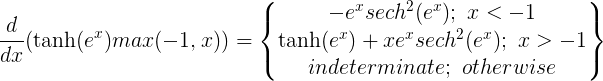
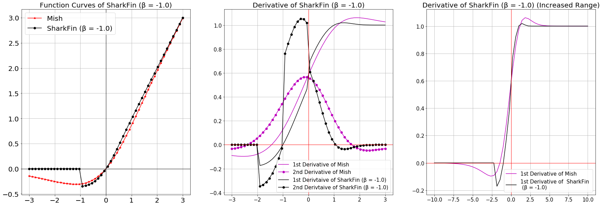
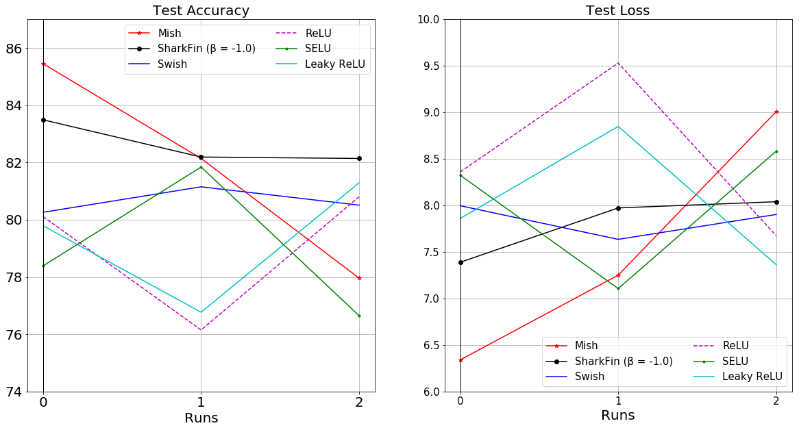

# SharkFin

    
    

 
 
 

SharkFin is a modified version of ReLU which has the following formula: 
 
**f(x) = Tanh(ex).ReLU(-1,x) = Tanh(ex).max(-1,x)**
 
Derivative: 

 

## CIFAR-10:

### ResNet v1-20

- Epoch - 20
- Optimizer - Adam
- Number of Runs - 3

|Activation Function|μ Test Accuracy|μ Test Loss|σ accuracy|σ loss|
|:---:|:---:|:---:|:---:|:---:|
|SharkFin|**82.6067%**|7.8006%|0.6249444|0.292334031|
|Mish|81.85%|**7.5327%**|3.064647|1.1073503|
|Swish|80.64%|7.8447%|0.3747888|0.152951|
|ReLU|79.02%|8.5212%|2.048854|0.7663393|
|SELU|78.96%|8.0047%|2.156803|0.6439562|
|ELU|80.497%|7.7353%|0.527278|0.405108|
|TanH|66.643%|12.6799%|**0.3068478**|0.2829257|
|Sigmoid|24.44%|38.2795%|13.715487|11.328736|
|Linear|38.953%|17.892%|0.4028509|**0.04750964**|
|SoftPlus|74.57%|10.291%|1.1881919|0.7724417|
|Softsign|55.396%|18.0109%|8.7452285|3.7473952|
|Leaky ReLU|79.483%|8.0239%|2.1014492|0.6178107|

### ResNet v1-56

- Epoch - 20
- Optimizer - Adam
- Number of Runs - 3

|Activation Function|μ Test Accuracy|μ Test Loss|σ accuracy|σ loss|
|:---:|:---:|:---:|:---:|:---:|
|SharkFin|82.167%|8.9934%|0.984626|0.4272043|
