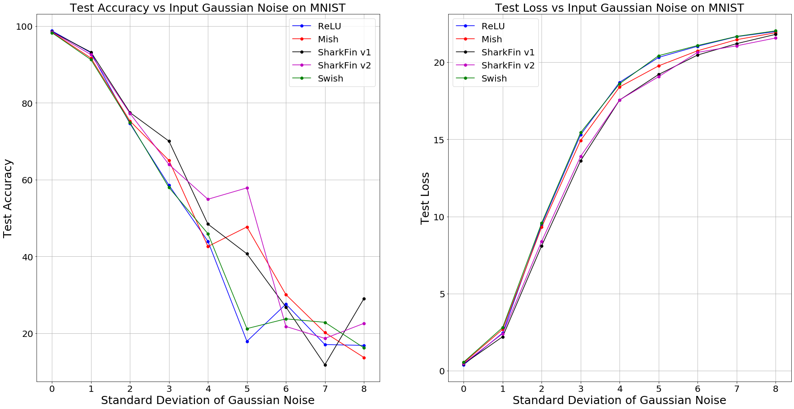

# SharkFin

    
    

 
 
 

SharkFin v1 is a modified version of ReLU which has the following formula: 
 
**f(x) = Tanh(ex).ReLU(-1,x) = Tanh(ex).max(-1,x)**
 

SharkFin v2 is a modified smoother version of SharkFin v1 which has the following formula: 
 
**f(x) = Tanh(ex).clamp(x, min_value = -1, max_value = None)**
 

Zoomed in positive and negative domains of SharkFins:

  
  

Derivative of SharkFin v1: 

 

 

Output Landscape of a randomly initialized six-layered fully connected network with co-ordinates as scalar inputs. 

Variation of Test accuracy with increasing depth for MNIST classification and increasing Learning Rate for CIFAR-10 classification:

  
  

Effect of Increasing Input Gaussian Noise on MNIST:

## CIFAR-10:

### ResNet 20

- Epoch - *20*
- Optimizer - *Adam*
- Number of Runs - *3*

|Activation Function|μ Test Accuracy|μ Test Loss|σ accuracy|σ loss|
|:---:|:---:|:---:|:---:|:---:|
|SharkFin v1|82.6067%|7.8006%|0.6249444|0.292334031|
|SharkFin v2|**83.346%**|**7.0009%**|0.936814|0.3490056|
|Mish|81.85%|7.5327%|3.064647|1.1073503|
|Swish|80.64%|7.8447%|0.3747888|0.152951|
|ReLU|79.02%|8.5212%|2.048854|0.7663393|
|SELU|78.96%|8.0047%|2.156803|0.6439562|
|ELU|80.497%|7.7353%|0.527278|0.405108|
|TanH|66.643%|12.6799%|**0.3068478**|0.2829257|
|SoftPlus|74.57%|10.291%|1.1881919|0.7724417|
|Leaky ReLU|79.483%|8.0239%|2.1014492|0.6178107|
|PReLU|82.4%|7.3859%|0.623591|**0.043733**|

### ResNet 56

- Epoch - *20*
- Optimizer - *Adam*
- Number of Runs - *3*

|Activation Function|μ Test Accuracy|μ Test Loss|σ accuracy|σ loss|
|:---:|:---:|:---:|:---:|:---:|
|SharkFin v1|**82.167%**|8.9934%|0.984626|0.4272043|
|SharkFin v2|81.726%|8.27379%|**0.7684327**|0.4026965|
|Swish|81.44%|**7.83062%**|0.7884584|**0.1659273**|
|ReLU|79.323%|8.7444%|1.082507|0.27063429|
|Mish|81.97%|7.8868%|0.803616|0.31262063|
|SELU|76.363%|9.380397%|2.0838639|0.6248774|
|ELU|80.387%|8.02079%|2.444931|0.8199566|
|Leaky ReLU|77.68%|8.79255%|1.0717275|0.4718626|
|PReLU|78.436%|8.82069%|1.506659|0.5329421|
|Tanh|61.783%|13.723%|6.305005|1.893993|
|SoftPlus|74.12%|10.71375%|4.335004|2.203364|

### ResNet 110

- Epoch - *20*
- Optimizer - *Adam*
- Number of Runs - *3*

|Activation Function|μ Test Accuracy|μ Test Loss|σ accuracy|σ loss|
|:---:|:---:|:---:|:---:|:---:|
|SharkFin v1|**82.436%**|9.122%|1.72445|**0.381466**|
|SharkFin v2|81.073%|8.2683%|1.9477|0.49388|
|Mish|79.586%|8.935%|1.3276|0.7712|
|Swish|81.866%|**7.768%**|1.3733|0.5738|
|ReLU|79.93%|8.7526%|1.97283|0.78605|
|Leaky ReLU|75.58%|9.8792%|**0.883**|0.4731|
|ELU|76.9%|9.3761%|2.82567|1.0487|
|PReLU|80.206%|8.3041%|2.4421|0.65091|
|SELU|59.51%|17.8528%|5.91592|4.62602|
|SoftPlus|66.21%|15.0434%|10.5295|6.215523|
|TanH|56.3%|17.4193%|4.213976|2.754786|

### ResNet 164

- Epoch - *20*
- Optimizer - *Adam*
- Number of Runs - *3*

|Activation Function|μ Test Accuracy|μ Test Loss|σ accuracy|σ loss|
|:---:|:---:|:---:|:---:|:---:|
|TanH|61.31%|14.751%|5.18421|2.22721|
|ELU|74.573%|10.1251%|1.254042|0.42463|

### DenseNet 121:

- Epoch - *20*
- Optimizer - *Adam*
- Number of Runs - *3*

|Activation Function|μ Test Accuracy|μ Test Loss|σ accuracy|σ loss|
|:---:|:---:|:---:|:---:|:---:|
|SharkFin v1|88.86%|3.479%|0.2392|0.07934|
|SharkFin v2|87.87%|3.752%|0.32499|0.10087|
|Mish|88.72%|3.5036%|0.6205|0.2128|
|Swish|88.53%|3.556%|0.32998|0.06773|
|ReLU|88.783%|3.446%|0.4219267|0.0894017|
|PReLU|86.186%|4.7193%|1.547952|0.6214484|
|ELU|87.463%|3.764%|0.19754|0.02889|
|SELU|87.28%|3.8036%|0.408493|0.1628953|
|SoftPlus|87.263%|3.843%|0.20548|0.1336|
|Leaky ReLU|88.823%|3.4777%|0.3300841|0.150386|

### DenseNet 161:

- Epoch - *20*
- Optimizer - *Adam*
- Number of Runs - *3*

|Activation Function|μ Test Accuracy|μ Test Loss|σ accuracy|σ loss|
|:---:|:---:|:---:|:---:|:---:|
|SharkFin v1|88.45%|3.591%|0.59704|0.16147|
|SharkFin v2|88.063%|3.6376%|0.709569|0.202559|
|Mish|88.056%|3.6893%|0.0492|0.0476|
|Swish|88.206%|3.6803%|0.26911|0.09676|
|ReLU|88.47%|3.6026%|0.53222|0.22308|
|PReLU|87.916%|3.895%|0.443946|0.0899827|

### DenseNet 169:

- Epoch - *20*
- Optimizer - *Adam*
- Number of Runs - *3*

|Activation Function|μ Test Accuracy|μ Test Loss|σ accuracy|σ loss|
|:---:|:---:|:---:|:---:|:---:|
|SharkFin v1|88.63%|3.568%|0.2345|0.12067|
|SharkFin v2|88.426%|3.627%|0.330689|0.133129|
|Mish|88.043%|3.912%|0.7153|0.285|
|Swish|88.516%|3.647%|0.29488|0.12399|
|ReLU|88.57%|3.5706%|0.20314|0.040532|
|PReLU|87.22%|4.449%|0.270102|0.1020881|

### DenseNet 201:

- Epoch - *20*
- Optimizer - *Adam*
- Number of Runs - *3*

|Activation Function|μ Test Accuracy|μ Test Loss|σ accuracy|σ loss|
|:---:|:---:|:---:|:---:|:---:|
|SharkFin v1|88.153%|3.6123%|0.25037|0.07541|
|SharkFin v2|88.303%|3.545%|0.40827|0.1465|
|Mish|**88.923%**|**3.4056%**|**0.0865**|0.0391|
|Swish|88.223%|3.734%|0.8794|0.3249|
|ReLU|88.273%|3.661%|0.62195|0.13418|
|ELU|88.12%|3.5056%|0.2885|0.109|
|Leaky ReLU|88.64%|3.525%|0.6023|0.1443|
|SELU|88.113%|3.5523%|0.1837|**0.01987**|
|Tanh|87.326%|3.914%|0.27108|0.09835|
|SoftPlus|87.776%|4.0336%|0.154344|0.071899|
|PReLU|87.893%|4.2%|0.659|0.324834|

### MobileNet v1

- Epoch - *20*
- Optimizer - *Adam*
- Number of Runs - *3*

|Activation Function|μ Test Accuracy|μ Test Loss|σ accuracy|σ loss|
|:---:|:---:|:---:|:---:|:---:|
|SharkFin v1|82.943%|5.304%|0.2597|0.0845|
|SharkFin v2|82.49%|5.3683%|**0.0694**|0.114|
|Mish|83.84%|5.424%|0.4899|0.2323|
|Swish|83.16%|5.3826%|0.3747|0.2046|
|ReLU|81.71%|5.7143%|1.2709|0.0541|
|SELU|81.52%|5.5006%|0.3842|0.1192|
|ELU|**84.016%**|**4.863%**|0.0974|0.0969|
|TanH|75.846%|7.23%|0.1643|0.0569|
|SoftPlus|83.323%|5.288%|0.3564|0.2323|
|Leaky ReLU|81.983%|5.5903%|0.3147|0.1404|
|PReLU|83.03%|5.2273%|0.0804|**0.0442**|

### MobileNet v2

- Epoch - *20*
- Optimizer - *Adam*
- Number of Runs - *3*

|Activation Function|μ Test Accuracy|μ Test Loss|σ accuracy|σ loss|
|:---:|:---:|:---:|:---:|:---:|
|SharkFin v1|80.926%|5.596%|0.3583|0.18|
|SharkFin v2|82.36%|5.2873%|0.8311|0.1468|
|Mish|82.57%|5.1986%|0.6265|0.1873|
|Swish|**83.123%**|**5.0693%**|**0.1369**|0.0275|
|ReLU|81.1%|5.5467%|0.5062|0.1236|
|SELU|78.603%|6.215%|0.4018|0.1679|
|ELU|80.69%|5.5603%|0.312|0.07998|
|TanH|74.836%|7.317%|0.996|0.3141|
|SoftPlus|80.86%|5.887%|0.2613|0.1298|
|Leaky ReLU|81.68%|5.3856%|0.3323|0.0991|
|PReLU|82.043%|5.2526%|0.4224|**0.0205**|

### Squeeze Excite ResNet-18

- Epoch - *20*
- Optimizer - *Adam*
- Number of Runs - *3*

|Activation Function|μ Test Accuracy|μ Test Loss|σ accuracy|σ loss|
|:---:|:---:|:---:|:---:|:---:|
|SharkFin v1|88.49%|3.718%|0.2174|0.0857|
|SharkFin v2|88.42%|3.822%|0.4846|0.149|
|Mish|88.603%|3.7193%|0.087|0.0314|
|Swish|**88.706%**|3.713%|0.1211|0.1843|
|ReLU|88.513%|**3.659%**|0.3231|0.1573|
|SELU|84.48%|4.76%|**0.0531**|0.0432|
|ELU|86.33%|4.174%|0.1388|**0.0151**|
|TanH|80.22%|5.9376%|0.5416|0.214|
|SoftPlus|82.596%|5.6286%|1.3666|0.6517|
|Leaky ReLU|88.02%|3.795%|0.304|0.0898|
|PReLU|86.213%|4.848%|1.0642|0.5222|

### Squeeze Excite ResNet-34

- Epoch - *20*
- Optimizer - *Adam*
- Number of Runs - *3*

|Activation Function|μ Test Accuracy|μ Test Loss|σ accuracy|σ loss|
|:---:|:---:|:---:|:---:|:---:|
|SharkFin v1|||||
|SharkFin v2|||||
|Mish|**89.01%**|3.672%|0.3749|0.1454|
|Swish|88.876%|3.629%|0.4614|0.1278|
|ReLU|88.223%|3.783%|0.1211|0.0615|
|SELU|85.58%|4.3613%|0.3182|0.1178|
|ELU|86.96%|4.0623%|**0.0927**|0.0254|
|TanH|79.816%|5.96%|0.8696|0.2911|
|SoftPlus|80.683%|6.0936%|2.4050|0.8019|
|Leaky ReLU|88.77%|**3.556%**|0.2122|**0.0192**|
|PReLU|88.06%|4.1553%|0.4143|0.2067|

### Squeeze Excite ResNet-50

- Epoch - *20*
- Optimizer - *Adam*
- Number of Runs - *3*

|Activation Function|μ Test Accuracy|μ Test Loss|σ accuracy|σ loss|
|:---:|:---:|:---:|:---:|:---:|
|SharkFin v1|||||
|SharkFin v2|||||
|Mish|87.973%|3.793%|0.2088|0.1493|
|Swish|87.186%|4.047%|0.4585|0.0657|
|ReLU|87.293%|3.9296%|1.0194|0.3583|
|SELU|83.5%|5.111%|0.286|0.0768|
|ELU|85.83%|4.459%|0.3187|0.0678|
|TanH|80.06%|5.974%|0.6646|0.1949|
|SoftPlus|81.65%|5.947%|0.811|0.4259|
|Leaky ReLU|88.27%|3.6376%|0.7186|0.2139|
|PReLU|86.44%|4.383%|1.1086|0.4608|

### Inception v3

- Epoch - *20*
- Optimizer - *Adam*
- Number of Runs - *3*

|Activation Function|μ Test Accuracy|μ Test Loss|σ accuracy|σ loss|
|:---:|:---:|:---:|:---:|:---:|
|SharkFin v1|86.57%|3.949%|0.4971|0.1357|
|SharkFin v2|**88.463%**|**3.481%**|0.491|0.1424|
|Mish|88.026%|3.609%|**0.1376**|**0.0962**|
|Swish|86.13%|4.09%|0.3642|0.238|
|ReLU|87.33%|3.838%|1.1725|0.2889|
|SELU|81.13%|5.458%|0.813|0.2523|
|ELU|83.82%|4.683%|0.9385|0.2807|
|TanH|77.93%|6.384%|0.4411|0.0976|
|SoftPlus|83.22%|5.0953%|0.8141|0.3352|
|Leaky ReLU|87.09%|3.833%|0.5516|0.1119|
|PReLU|86.43%|4.157%|0.2219|0.1081|

### Shuffle Net v1

- Epoch - *20*
- Optimizer - *Adam*
- Number of Runs - *3*

|Activation Function|μ Test Accuracy|μ Test Loss|σ accuracy|σ loss|
|:---:|:---:|:---:|:---:|:---:|
|SharkFin v1|84.013%|4.789%|0.6918|0.19|
|SharkFin v2|84.953%|4.759%|0.1936|0.0396|
|Mish|84.65%|4.774%|0.4035|0.1424|
|Swish|84.65%|4.749%|0.1687|0.1069|
|ReLU|83.24%|5.0856%|0.1496|0.0383|
|SELU|84.68%|4.637%|0.2758|0.136|
|ELU|**85.13%**|**4.534%**|0.3634|0.1217|
|TanH|77.523%|6.5565%|0.0997|0.0466|
|SoftPlus|81.583%|5.86%|0.7021|0.0683|
|Leaky ReLU|84.046%|4.846%|**0.04496**|**0.0264**|
|PReLU|83.55%|5.146%|0.5219|0.2355|

### Shuffle Net v2

- Epoch - *20*
- Optimizer - *Adam*
- Number of Runs - *3*

|Activation Function|μ Test Accuracy|μ Test Loss|σ accuracy|σ loss|
|:---:|:---:|:---:|:---:|:---:|
|SharkFin v1|83.8%|4.8323%|0.1994|0.0753|
|SharkFin v2|83.83%|4.928%|0.2397|0.0484|
|Mish|84.77%|**4.626%**|0.2163|0.0477|
|Swish|84.8%|4.664%|0.2082|0.0885|
|ReLU|82.72%|5.217%|0.2416|0.0794|
|SELU|81.986%|5.286%|**0.0573**|0.0836|
|ELU|83.376%|4.895%|0.2174|0.0759|
|TanH|76.786%|6.908%|0.4219|0.1727|
|SoftPlus|83.88%|4.903%|0.1687|0.0966|
|Leaky ReLU|**84%**|4.798%|0.3961|0.0666|
|PReLU|83.406%|5.0236%|0.2239|**0.0342**|

### Squeeze Net:

- Epoch - *20*
- Optimizer - *Adam*
- Number of Runs - *1*

|Activation Function |Test Accuracy|Test Loss|
|:---:|:---:|:---:|
|SharkFin v1|83.41%|4.9%|
|SharkFin v2|**85.84%**|4.419%|
|ReLU|84.74%|4.503%|
|Mish|84.96%|4.381%|
|Swish|85.73%|**4.175%**|
|ELU|83.17%|4.875%|
|SELU|81.12%|5.581%|
|Leaky ReLU|84.08%|4.757%|
|PReLU|83.84%|4.831%|
|TanH|76.68%|6.75%|
|SoftPlus|83.83%|4.799%|

